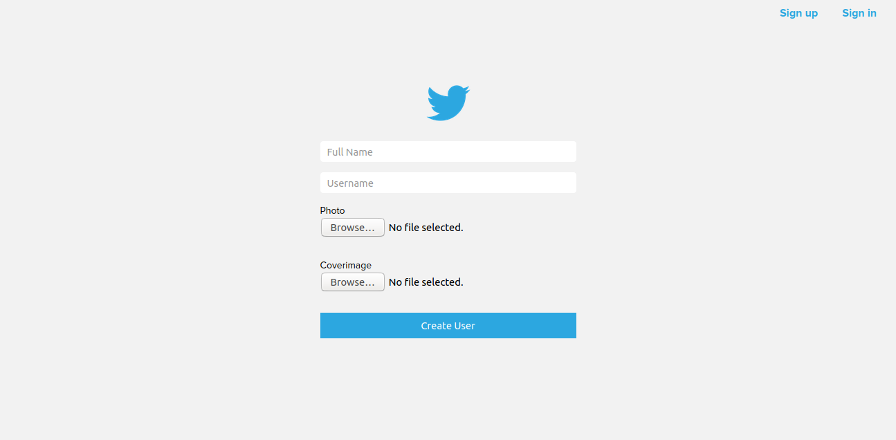
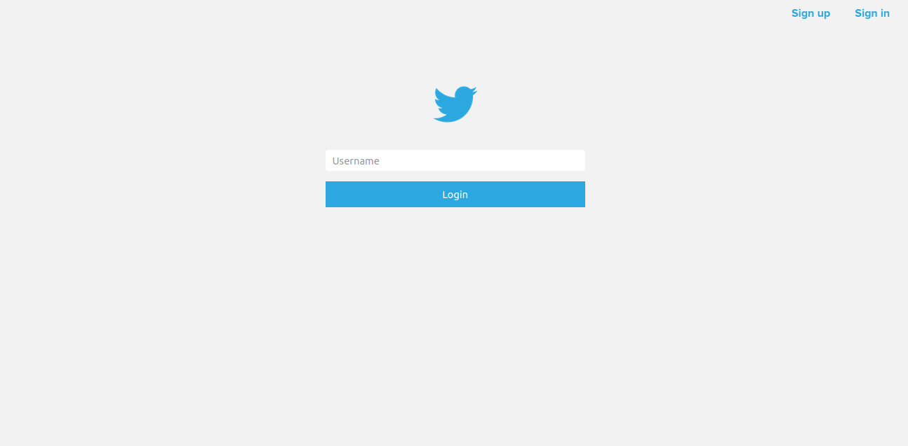
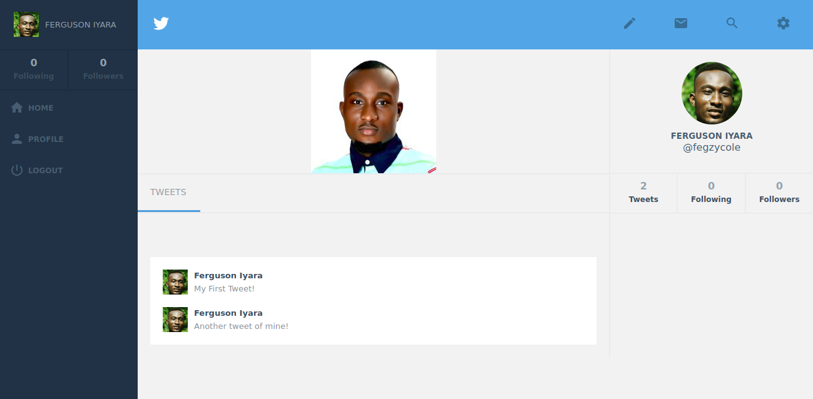

[![Contributors][contributors-shield]][contributors-url]
[![Issues][issues-shield]][issues-url]
 

 
  <h2 align="center">Twitter Redesign</h2>
  

     
    <a href="https://github.com/kalavhan/facebook-clone/"><strong>Explore the docs »</strong></a>
     
     
    ·
    <a href="https://github.com/kalavhan/facebook-clone/issues">Report Bug</a>
    ·
    <a href="https://github.com/kalavhan/facebook-clone/issues">Request Feature</a>
  

<!-- TABLE OF CONTENTS -->
## Table of Contents

* [About the Project](#about-the-project)
  * [Built With](#built-with)
  * [Prerequisites](#prerequisites)
* [Credit](#credit)
* [Usage](#usage)
* [Screenshots](#screenshots)
* [Live Version](#live-version)
* [Testing](#testing)
* [Future Improvements](#future-improvements)
* [License](#license)
* [Contact](#contact)

<!-- ABOUT THE PROJECT -->
## About The Project

A social media application mimicking some of the functionalities of twitter.com, built as a capstone project in the rails section of the microverse curriculum.

### Built With

This project was built with Ruby on rails version 6

## Prerequisites
 - Git
 - Ruby
 - Ruby on rails version 6
 - Yarn
 - Node.js
 - NPM
 - PostgreSQL

## Credit

- [Gregoire Vella](https://www.behance.net/gregoirevella)

## Screenshots

### Signup Page

### Signin Page

### Homepage

### Userpage

## Usage

- git clone https://github.com/fegzycole/Rails-capstone.git

- cd Rails-capstone

- bundle update

- bundle install

- rails db:create

- rails db:migrate (to add tables and columns)

- rails server to fire the rails server

## Live Version

- You can view the app [Here](https://secure-shelf-49955.herokuapp.com/)

## Testing

- git clone https://github.com/fegzycole/Rails-capstone.git

- cd Rails-capstone

- bundle update

- bundle install

- rails db:create

- rails db:migrate (to add tables and columns)

- Run **rspec** in your terminal to run all test suites

<!-- FUTURE IMPROVEMENTS -->
## Future Improvements

See the [open issues](https://github.com/fegzycole/Rails-capstone/issues) for a list of proposed features (and known issues).

<!-- LICENSE -->
## License

Distributed under the MIT License. See `LICENSE` for more information.

<!-- CONTACT -->
## Contact
Ferguson Iyara - [Github profile](https://github.com/fegzycole)

Project Link: [Project repo](https://github.com/fegzycole/Rails-capstone)

<!-- MARKDOWN LINKS & IMAGES -->
<!-- https://www.markdownguide.org/basic-syntax/#reference-style-links -->
[contributors-shield]: https://img.shields.io/badge/Contributors-1-%2300ff00
[contributors-url]: https://github.com/fegzycole/Rails-capstone/graphs/contributors
[issues-shield]: https://img.shields.io/badge/issues-0-%2300ff00
[issues-url]: https://github.com/fegzycole/Rails-capstone/issues/